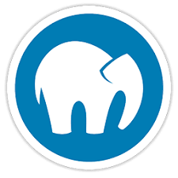
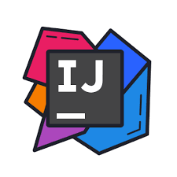

### Hi there, I`m Oleg 👋
## I`m WEb developer
- i like to write code on Java & PHP
- I`m constantly learning new things
## Connect with me:

 
## Languages & Tools: 

<!--
**Olsattt/Olsattt** is a ✨ _special_ ✨ repository because its `README.md` (this file) appears on your GitHub profile.

Here are some ideas to get you started:

### 🔭 I’m currently working on ...
- 🌱 I’m currently learning ...
- 👯 I’m looking to collaborate on ...
- 🤔 I’m looking for help with ...
- 💬 Ask me about ...
- 📫 How to reach me: ...
- 😄 Pronouns: ...
- ⚡ Fun fact: ...
-->
